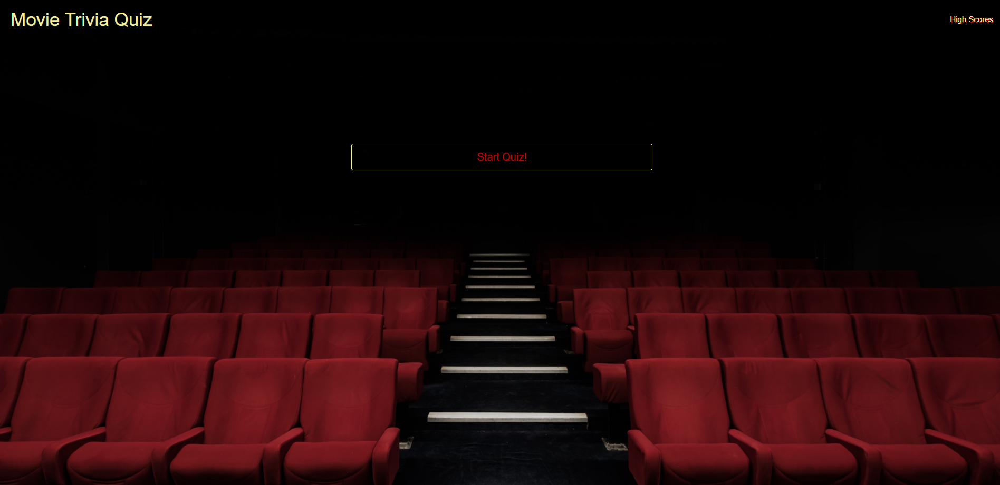
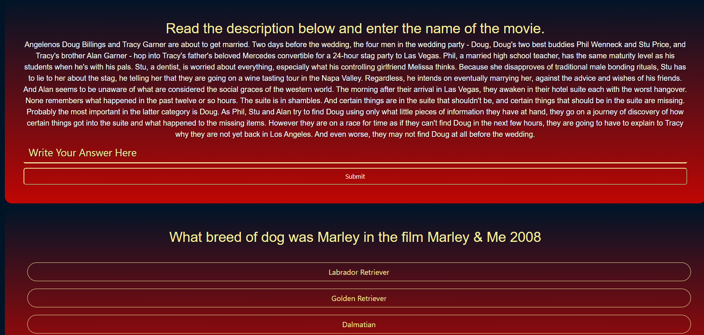

# Movie Trivia Quiz

# Description
This is our movie trivia project. We created it utilizing the OMDb and opentdb api's, along with local storage to save high scores. 

When you click on the start quiz button, you will be taken to a page with ten randomly generated question, some multiple choice, some true or fale, and some where you have to type in your answer.

When you click on an answer, it will be highlighted navy blue indicating you've selected it.

For the questions that you type in your own answer, make sure you click the submit button under the user input box. It will clear the text field but don't worry, your answer will be saved.

Upon completion of the questions, click the submit your answers button to be redirected to a page where you can put in your initials and save your high score.

Click the initials placeholder to type in your initials. Then press submit score to save your high score into the local storage. 

# 
You can then click View High Scores to be redirected to a page with all of the high scores.
# 
You can also view high scores by clicking high scores in the top right corner of the homepage.

# Credits
Creators: Jared Colletti, Ben Thackray, Gunnar Ulatowski

#  Installation
Link to deployed site: https://sushistarlove.github.io/movie-trivia-jbg/

Link to github repo: https://github.com/sushistarlove/movie-trivia-jbg